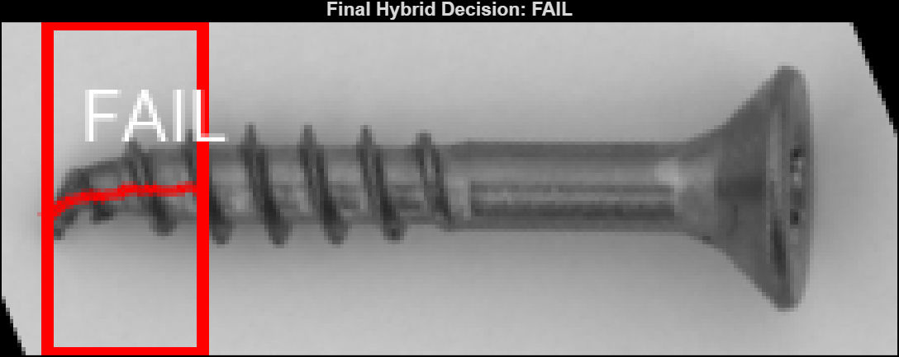

# Project name: Image-Based Defect Detection for Manufacturing Inspection

# PROJECT OBJECTIVE:
Incorporates classical computer vision methods and use transfer learning with Resnet-18 to detect defects in MVTec AD screw images. The system classifies parts as PASS or FAIL and evaluates deficiencies based on Binary mask, segmentations, overlays, contras and other image processing techniques.

<p align="center">
  
</p>

<p align="center">
  <em>Example hybrid inspection result showing a defective screw classified as FAIL.</em>
</p>


## Project Files: 

```text
project/
├── data/               # MVTec AD Screw dataset (download separately)
├── documentation/      # Live Script, exported PDF, and project documentation
├── experimental/       # Experimental scripts developed during testing
├── models/             # Trained ResNet-18 model
├── results/            # Evaluation results, plots, and confusion matrices
├── scripts/            # Main workflow scripts
├── src/                # Reusable MATLAB helper functions
└── README.md           # a summary of project objectives/libraries/models/organization/dependencies 
└── live script         # an overview of the code with descriptions of how and why it was use 
          
```

## Project Dependencies 

This project was developed in MATLAB using the following products:

- MATLAB 2026a
- Deep Learning Toolbox
- Image Processing Toolbox
- Resnet 18 model


## Dataset Setup

This repository does not include the MVTec AD dataset due to its large file size.

### Download the Dataset

1. Visit the [MVTec AD dataset](https://www.mvtec.com/research-teaching/datasets/mvtec-ad) page.
2. Accept the non-commercial use agreement to access the download page.
3. Under **Download Individual Object Categories**, download the **Screw (186 MB)** dataset. The full dataset is **not required** for this project.
4. Extract the downloaded archive.
5. Place the extracted `screw` folder in the following directory:

```text
data/
└── MVTec AD/
    └── screw/
        ├── train/
        ├── test/
        └── ground_truth/
```

The project scripts assume this directory structure and will automatically load the dataset from this location.


## How to Run the Project code and model:

1. Clone or download this repository.
2. Download and place the MVTec AD Screw dataset in the required `data/MVTec AD/screw/` directory.
3. Open MATLAB and set the repository folder as the current folder.
4. Open the main MATLAB Live Script located in the `documentation/` folder.
5. Run the Live Script sections in order to reproduce the dataset preparation, preprocessing, training, evaluation, and robustness testing results.


## Project Workflow

The project follows five main stages:

1. Dataset preparation and label selection
2. Image preprocessing
3. Classical computer vision and feature extraction
4. ResNet-18 classification training
5. System evaluation (AI, Hybrid, Classical)
6. Robustness testing under simulated image variations

